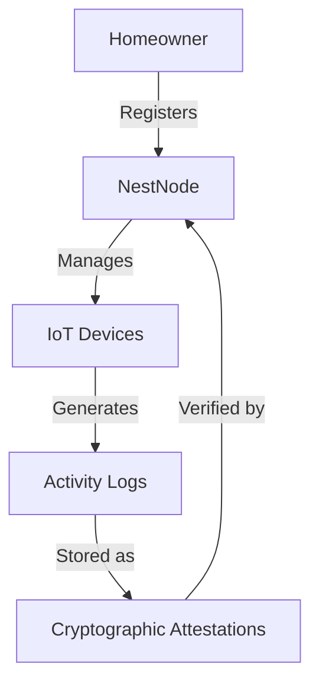

# Secure Home IoT Logger

A blockchain-based system for creating tamper-proof records of home IoT device activities using the Stacks blockchain. This solution provides homeowners with cryptographic proof of device operations while maintaining privacy through hash-based attestations.

## Overview

The Secure Home IoT Logger creates an immutable audit trail of home automation events by storing cryptographic proofs on the Stacks blockchain. It addresses several critical needs in home automation:

- Security verification of device activities
- Tamper-proof historical records of device operations
- Dispute resolution for device activations
- Privacy-preserving activity logging

Key features:
- NestNode system registration
- IoT device management
- Secure activity logging with cryptographic attestations
- Verification capabilities for historical device states

## Architecture

The system consists of a single smart contract that manages device registration and activity logging. The architecture follows a hub-and-spoke model where:

1. Each home has a central NestNode that acts as the primary authority
2. Multiple IoT devices can be registered under each NestNode
3. Device activities are recorded as cryptographic attestations



## Contract Documentation

### home-iot-logger

The main contract handling all IoT logging functionality.

#### Data Storage
- `nest-nodes`: Maps owner principals to NestNode information
- `devices`: Stores registered device information
- `activity-logs`: Contains cryptographic proofs of device activities
- `owner-devices`: Tracks all devices registered to each owner

#### Access Control
- Only registered NestNode owners can register devices and log activities
- Each device can only be registered once per owner
- Activity logs are immutable once recorded

## Getting Started

### Prerequisites
- Clarinet
- Stacks wallet
- NestNode system ID

### Installation

1. Clone the repository
2. Install dependencies with Clarinet
```bash
clarinet integrate
```

### Basic Usage

1. Register your NestNode:
```clarity
(contract-call? .home-iot-logger register-nest-node "your-nest-node-id")
```

2. Register an IoT device:
```clarity
(contract-call? .home-iot-logger register-device "device-id" "Living Room Camera" "security-camera")
```

3. Log device activity:
```clarity
(contract-call? .home-iot-logger log-device-activity "device-id" u1234567890 0x... 0x...)
```

## Function Reference

### Registration Functions

```clarity
(register-nest-node (nest-node-id (string-ascii 64)))
```
Registers a new NestNode system for the homeowner.

```clarity
(register-device (device-id (string-ascii 64)) (device-name (string-ascii 64)) (device-type (string-ascii 32)))
```
Registers a new IoT device to the homeowner's network.

### Logging Functions

```clarity
(log-device-activity (device-id (string-ascii 64)) (timestamp uint) (action-hash (buff 32)) (attestation-hash (buff 32)))
```
Records an activity attestation for a device.

### Query Functions

```clarity
(get-nest-node-info (owner principal))
(get-device-info (owner principal) (device-id (string-ascii 64)))
(get-owner-devices (owner principal))
(get-activity-log (owner principal) (device-id (string-ascii 64)) (timestamp uint))
```

### Verification Functions

```clarity
(verify-activity-attestation (owner principal) (device-id (string-ascii 64)) (timestamp uint) (provided-attestation-hash (buff 32)))
(was-device-active (owner principal) (device-id (string-ascii 64)) (timestamp uint))
```

## Development

### Testing

Run the test suite:
```bash
clarinet test
```

### Local Development
1. Start Clarinet console:
```bash
clarinet console
```

2. Deploy contract:
```bash
clarinet deploy
```

## Security Considerations

### Limitations
- Maximum 100 devices per owner
- Activity logs are permanent and cannot be deleted
- Only hash-based attestations are stored on-chain

### Best Practices
- Generate strong, unique device IDs
- Securely store off-chain activity details
- Regularly verify activity attestations
- Keep NestNode credentials secure
- Implement proper hash generation for attestations

### Privacy
- No sensitive device data is stored on-chain
- Only cryptographic hashes are recorded
- Device activities can only be verified with knowledge of the original data